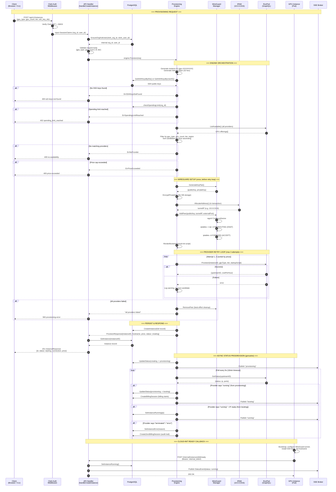
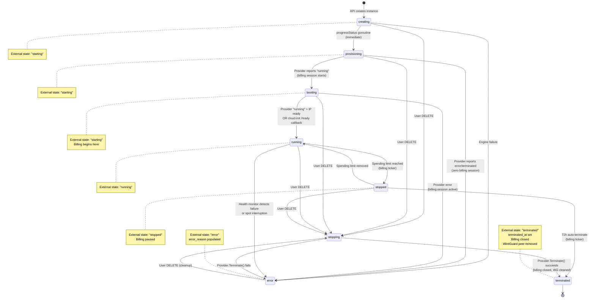
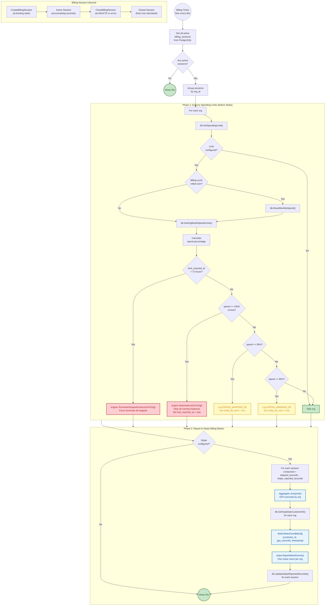
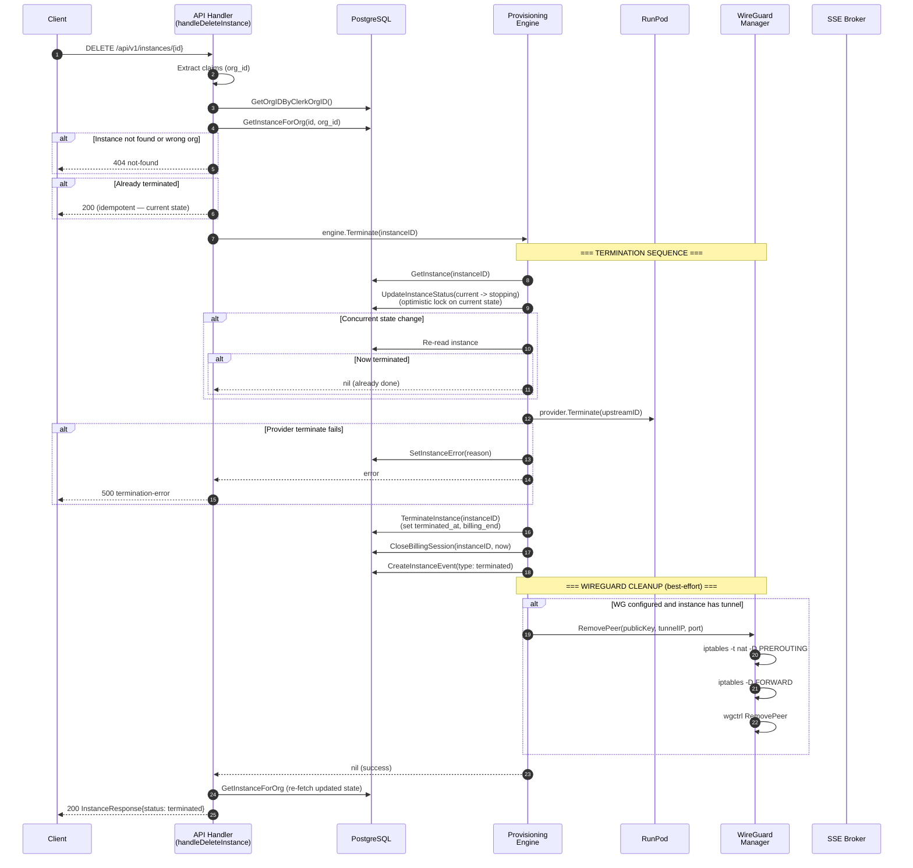
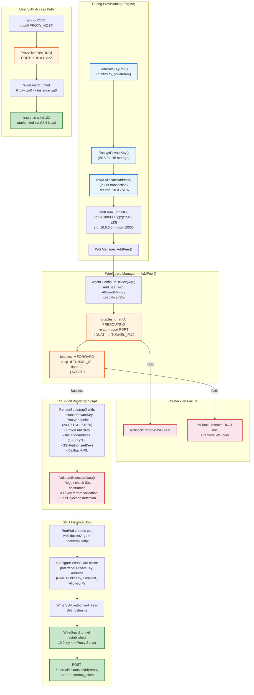

# GPU.ai Phase 1 — Architecture Diagrams

> Complete system workflow covering auth, billing, GPU provisioning, WireGuard networking, health monitoring, and error handling.

---

## 1. System Architecture Overview

```mermaid
flowchart TB
    %% ============================================================
    %% GPU.AI PHASE 1 — HIGH-LEVEL SYSTEM ARCHITECTURE
    %% ============================================================

    subgraph CLIENTS["Clients"]
        direction LR
        browser["Browser<br/>(Dashboard)"]
        cli["CLI / API<br/>Consumer"]
    end

    subgraph FRONTEND["Frontend — Next.js + Clerk"]
        direction TB
        clerkMW["Clerk Middleware<br/>(proxy.ts)"]
        pages["Dashboard Pages<br/>(SWR Data Fetching)"]
        apiClient["Typed API Client<br/>(api.ts)"]
        pages --> apiClient
    end

    subgraph GPUCTL["gpuctl — Go API Server (:9090)"]
        direction TB

        subgraph MIDDLEWARE["Middleware Chain"]
            direction LR
            mwClerk["ClerkAuth<br/>JWT + JWKS"]
            mwOrg["RequireOrg<br/>403 guard"]
            mwRate["OrgRateLimiter<br/>10 req/s burst 20"]
            mwIdemp["Idempotency<br/>POST dedup"]
            mwClerk --> mwOrg --> mwRate --> mwIdemp
        end

        subgraph PUBLIC_API["Public API — /api/v1"]
            direction TB
            instCRUD["Instances<br/>POST GET DELETE"]
            sshCRUD["SSH Keys<br/>POST GET DELETE"]
            billAPI["Billing<br/>Usage + Spending Limits"]
            gpuAvail["GPU Availability<br/>GET /gpu/available"]
            sseStream["SSE Streams<br/>/instances/id/events<br/>/events"]
        end

        subgraph INTERNAL_API["Internal API"]
            direction TB
            readyCB["POST /internal/.../ready<br/>(cloud-init callback)"]
            healthCB["POST /internal/.../health<br/>(health ping)"]
            intAuth["InstanceTokenAuth<br/>(per-instance token)"]
        end

        sseBroker["StatusBroker<br/>+ OrgEventBroker"]
    end

    subgraph CORE["Core Services"]
        direction TB
        engine["Provisioning Engine<br/>(provision.Engine)"]
        billingTicker["Billing Ticker<br/>(60s loop)"]
        availPoller["Availability Poller<br/>(30s loop)"]
        healthMon["Health Monitor<br/>(60s loop)"]
    end

    subgraph DATA["Data Layer"]
        direction LR
        pg[("PostgreSQL<br/>instances, orgs,<br/>billing_sessions,<br/>ssh_keys, events,<br/>spending_limits")]
        redis[("Redis<br/>availability cache,<br/>idempotency keys")]
    end

    subgraph INFRA["WireGuard Proxy Server"]
        direction TB
        wgMgr["WG Manager<br/>(wgctrl-go)"]
        ipam["IPAM<br/>(10.0.0.0/16)"]
        iptables["iptables<br/>DNAT + FORWARD"]
        wgIface["wg0 Interface"]
        wgMgr --> wgIface
        wgMgr --> iptables
    end

    subgraph EXTERNAL["External Services"]
        direction LR
        clerk["Clerk<br/>(Auth + JWKS)"]
        stripe["Stripe<br/>(Billing Meters)"]
        runpod["RunPod<br/>(GraphQL API)"]
    end

    subgraph INSTANCE["GPU Instance (RunPod Pod)"]
        direction TB
        cloudInit["Cloud-Init<br/>Bootstrap Script"]
        wgClient["WireGuard Client<br/>(tunnel to proxy)"]
        sshd["sshd :22"]
        cloudInit --> wgClient
        cloudInit --> sshd
    end

    %% === Client connections ===
    browser --> clerkMW
    cli --> mwClerk
    clerkMW --> pages

    %% === Frontend to API ===
    apiClient -->|"fetch /api/v1/*"| MIDDLEWARE

    %% === Middleware to routes ===
    MIDDLEWARE --> PUBLIC_API
    intAuth --> INTERNAL_API

    %% === Public API to core ===
    instCRUD -->|"Provision / Terminate"| engine
    gpuAvail -->|"Read cache"| redis
    billAPI -->|"Query sessions"| pg
    sshCRUD -->|"CRUD"| pg
    sseStream --> sseBroker

    %% === Core service connections ===
    engine -->|"Create/poll pods"| runpod
    engine -->|"Persist state"| pg
    engine -->|"WG key gen + AddPeer"| wgMgr
    engine -->|"Allocate IP"| ipam
    engine -->|"Status events"| sseBroker

    billingTicker -->|"Read sessions"| pg
    billingTicker -->|"Report GPU-seconds"| stripe
    billingTicker -->|"Stop/terminate"| engine

    availPoller -->|"ListAvailable"| runpod
    availPoller -->|"Cache offerings<br/>(+markup)"| redis

    healthMon -->|"GetStatus"| runpod
    healthMon -->|"Update state"| pg
    healthMon -->|"Publish events"| sseBroker

    %% === Internal callbacks ===
    INSTANCE -->|"POST /ready"| readyCB
    INSTANCE -->|"POST /health"| healthCB

    %% === Instance networking ===
    wgClient -.->|"WireGuard tunnel"| wgIface
    iptables -.->|"DNAT port:N -> 10.x.x.x:22"| wgClient

    %% === Auth ===
    mwClerk -.->|"Verify JWT"| clerk

    %% === Styling ===
    classDef external fill:#e8f4fd,stroke:#1976d2,stroke-width:2px,color:#0d47a1
    classDef data fill:#fce4ec,stroke:#c62828,stroke-width:2px,color:#b71c1c
    classDef core fill:#e8f5e9,stroke:#2e7d32,stroke-width:2px,color:#1b5e20
    classDef infra fill:#fff3e0,stroke:#e65100,stroke-width:2px,color:#bf360c
    classDef instance fill:#f3e5f5,stroke:#6a1b9a,stroke-width:2px,color:#4a148c

    class clerk,stripe,runpod external
    class pg,redis data
    class engine,billingTicker,availPoller,healthMon core
    class wgMgr,ipam,iptables,wgIface infra
    class cloudInit,wgClient,sshd instance
```



---

## 2. GPU Provisioning Lifecycle



---

## 3. Instance State Machine



---

## 4. Authentication & Middleware Pipeline

```mermaid
flowchart LR
    %% ============================================================
    %% AUTH & MIDDLEWARE PIPELINE
    %% ============================================================

    req["Incoming<br/>HTTP Request"] --> split{Route Type?}

    %% === PUBLIC API PATH ===
    split -->|"/api/v1/*"| clerkAuth

    subgraph AUTH_CHAIN["Authenticated Route Chain"]
        direction LR

        clerkAuth{"ClerkAuth<br/>Middleware"} -->|"CLERK_SECRET_KEY set"| jwtVerify["Verify JWT<br/>via Clerk JWKS"]
        clerkAuth -->|"CLERK_SECRET_KEY empty"| devUser["Inject dev-user<br/>dev-org claims"]

        jwtVerify --> jwtCheck{Valid JWT?}
        jwtCheck -->|No| reject401a["401 Unauthenticated"]
        jwtCheck -->|Yes| injectClaims["Inject SessionClaims<br/>into context"]
        devUser --> injectClaims

        injectClaims --> orgCheck{"RequireOrg<br/>Middleware"}
        orgCheck -->|"No active org"| reject403["403 org-required"]
        orgCheck -->|"Org present"| rateLim

        rateLim{"OrgRateLimiter"} -->|"> 10 req/s"| reject429["429 Too Many Requests"]
        rateLim -->|"Under limit"| methodCheck{POST?}

        methodCheck -->|Yes| idemp["Idempotency<br/>Middleware<br/>(check Redis)"]
        methodCheck -->|No| handler["Route Handler"]

        idemp --> idempCheck{Duplicate<br/>request?}
        idempCheck -->|Yes| cached["Return cached<br/>response"]
        idempCheck -->|No| handler
    end

    %% === INTERNAL CALLBACK PATH ===
    split -->|"/internal/*"| tokenAuth

    subgraph INTERNAL_AUTH["Instance Token Auth"]
        direction LR
        tokenAuth["Extract Bearer token<br/>from Authorization header"] --> lookupToken["DB lookup:<br/>match token to instance"]
        lookupToken --> tokenValid{Token valid<br/>for instance ID?}
        tokenValid -->|No| reject401b["401 Unauthorized"]
        tokenValid -->|Yes| intHandler["Internal Handler<br/>(ready / health)"]
    end

    %% === HEALTH ENDPOINT PATH ===
    split -->|"GET /health"| localOnly

    subgraph HEALTH_AUTH["Health Check Auth"]
        direction LR
        localOnly["LocalhostOnly<br/>Middleware"] --> internalAuth["InternalAPI<br/>TokenAuth"]
        internalAuth --> healthHandler["handleHealth<br/>(DB + Redis ping)"]
    end

    %% === CLAIMS EXTRACTION ===
    handler --> claimsExtract["auth.ClaimsFromContext()<br/>Returns {UserID, OrgID}"]
    claimsExtract --> dbLookup["db.EnsureOrgAndUser()<br/>or db.GetOrgIDByClerkOrgID()"]
    dbLookup --> bizLogic["Business Logic<br/>(scoped to org)"]

    %% === Styling ===
    classDef reject fill:#ffcdd2,stroke:#c62828,stroke-width:2px,color:#b71c1c
    classDef success fill:#c8e6c9,stroke:#2e7d32,stroke-width:2px,color:#1b5e20
    classDef check fill:#fff9c4,stroke:#f9a825,stroke-width:2px,color:#f57f17

    class reject401a,reject401b,reject403,reject429 reject
    class handler,intHandler,healthHandler,bizLogic success
    class jwtCheck,orgCheck,tokenValid,idempCheck,methodCheck check
```



---

## 5. Billing & Spending Limit Enforcement



---

## 6. Health Monitoring & Error Recovery

```mermaid
flowchart TD
    %% ============================================================
    %% HEALTH MONITOR — 60-SECOND LOOP
    %% ============================================================

    start(("Health Monitor<br/>fires every 60s")) --> listActive["db.ListActiveInstances()<br/>(running + booting)"]

    listActive --> hasInst{Any active<br/>instances?}
    hasInst -->|No| sleep(("Sleep 60s"))
    hasInst -->|Yes| fanOut["Fan out checks<br/>(max 10 concurrent)"]

    fanOut --> checkInst["For each instance"]
    checkInst --> lookupProv["registry.Get(upstream_provider)"]

    lookupProv --> provFound{Provider<br/>found?}
    provFound -->|No| logWarn["Log warning<br/>(orphaned instance)"]
    provFound -->|Yes| pollStatus["provider.GetStatus(upstream_id)"]

    pollStatus --> pollOk{Poll<br/>succeeded?}
    pollOk -->|No| logPollFail["Log warning<br/>(will retry next tick)"]

    pollOk -->|Yes| statusCheck{Upstream<br/>status?}

    %% === HEALTHY ===
    statusCheck -->|"running"| healthy["Healthy<br/>(no action)"]

    %% === SPOT INTERRUPTION ===
    statusCheck -->|"terminated / error"<br/>AND tier = spot| spotPath

    subgraph SPOT["Spot Interruption Handler"]
        direction TB
        spotPath["Detected: spot interruption"] --> spotLock["Optimistic lock:<br/>UpdateInstanceStatus -> error"]
        spotLock --> spotLocked{Lock<br/>acquired?}
        spotLocked -->|No| spotSkip["Status changed concurrently<br/>(skip — already handled)"]
        spotLocked -->|Yes| spotError["SetInstanceError<br/>(spot instance interrupted)"]
        spotError --> spotBilling["CloseBillingSession<br/>(immediate — stop charges)"]
        spotBilling --> spotEvent["CreateInstanceEvent<br/>(type: interrupted)"]
        spotEvent --> spotSSE["Publish to OrgEventBroker<br/>(SSE notification)"]
    end

    %% === NON-SPOT FAILURE ===
    statusCheck -->|"terminated / error"<br/>AND tier = on_demand| nonSpotPath

    subgraph NONSPOT["Non-Spot Failure Handler (with retries)"]
        direction TB
        nonSpotPath["Detected: possible failure"] --> retryLoop

        retryLoop["Retry loop<br/>(3 attempts, 10s apart)"]
        retryLoop --> recheck["Re-read instance from DB"]
        recheck --> statusChanged{Status changed<br/>concurrently?}
        statusChanged -->|Yes| abortRetry["Abort retries<br/>(user terminated, etc.)"]
        statusChanged -->|No| repoll["provider.GetStatus()"]
        repoll --> recovered{Status =<br/>"running"?}
        recovered -->|Yes| falseAlarm["False alarm<br/>(transient blip)"]
        recovered -->|No| nextRetry{More<br/>retries?}
        nextRetry -->|Yes| retryLoop
        nextRetry -->|No| declareFailure["INSTANCE_FAILURE:<br/>all retries exhausted"]

        declareFailure --> failLock["Optimistic lock:<br/>UpdateInstanceStatus -> error"]
        failLock --> failError["SetInstanceError<br/>(provider reports terminated)"]
        failError --> failBilling["CloseBillingSession"]
        failBilling --> failEvent["CreateInstanceEvent<br/>(type: failed)"]
        failEvent --> failSSE["Publish to OrgEventBroker"]
    end

    %% Return paths
    logWarn --> sleep
    logPollFail --> sleep
    healthy --> sleep
    spotSSE --> sleep
    spotSkip --> sleep
    abortRetry --> sleep
    falseAlarm --> sleep
    failSSE --> sleep

    %% === Styling ===
    classDef critical fill:#ffcdd2,stroke:#c62828,stroke-width:2px,color:#b71c1c
    classDef warning fill:#fff9c4,stroke:#f9a825,stroke-width:2px,color:#f57f17
    classDef ok fill:#c8e6c9,stroke:#2e7d32,stroke-width:2px,color:#1b5e20
    classDef info fill:#e8f4fd,stroke:#1976d2,stroke-width:2px,color:#0d47a1

    class spotPath,declareFailure,spotError,failError critical
    class logWarn,logPollFail,nonSpotPath warning
    class healthy,falseAlarm,spotSkip,abortRetry ok
    class spotSSE,failSSE,spotEvent,failEvent info
```

---

## 7. Termination Flow



---

## 8. WireGuard Networking Detail



---

## Legend

| Color | Meaning |
|-------|---------|
| Blue (`#e8f4fd`) | External services / info states |
| Red (`#fce4ec` / `#ffcdd2`) | Data stores / critical errors |
| Green (`#c8e6c9` / `#e8f5e9`) | Success / healthy states |
| Orange (`#fff3e0`) | Infrastructure / WireGuard |
| Yellow (`#fff9c4`) | Warnings / decision points |
| Purple (`#f3e5f5`) | GPU instance internals |
